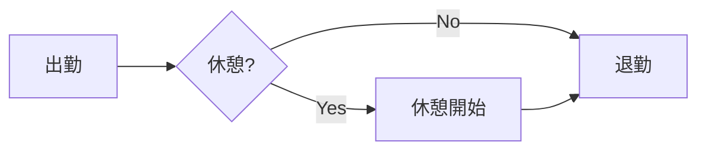

# WIKI 機能 設計書

> 作成日: 2026-02-25
> 関連: [spec_roadmap.md](./spec_roadmap.md)
>
> **注記**: 本書はフェーズ1設計時（Tiptap + Yjs 採用方針）の設計書である。
> 実際の実装は方針を変更し、Toast UI Editor + Markdown で完成した。
> 実装実績は「実装実績」セクションを参照。

---

## 実装実績（2026-02-26 完了）

当初計画（Tiptap + Yjs）から方針変更し、**Toast UI Editor + Markdown** で実装した。
既存の実装詳細は [spec_roadmap.md §3.11](./spec_roadmap.md) および [api-design.md §21-23](./api-design.md) を参照。

### 採用技術（実際）

| 項目 | 計画 | 採用（実際） |
|------|------|------------|
| エディタ | Tiptap v2（ブロック型） | **Toast UI Editor**（WYSIWYG + Markdownモード切替） |
| コンテンツ形式 | JSON | **Markdown TEXT** |
| リアルタイム共同編集 | Yjs + ypy-websocket | **なし**（将来フェーズ） |
| ストレージ | `content JSON` + `yjs_state BYTEA` | **`content TEXT`** のみ |

### 実装済み機能

| 機能 | 詳細 |
|------|------|
| ページ CRUD | タイトル、本文（Markdown）、slug（自動生成）、visibility、カテゴリ、タグ |
| 階層構造 | `parent_id` 自己参照、パンくずナビ、ページツリー取得 |
| タグ管理 | 多対多（`wiki_page_tags`）、タグ名検索、slug自動生成 |
| カテゴリ管理 | 単一分類（admin管理）、表示色 |
| 全文検索 | PostgreSQL TSVECTOR + GINインデックス（タイトル対象） |
| ページ移動 | 親ページ変更（循環参照防止チェック） |
| タスクリンク① | タスクリストアイテムへの永続リンク（`wiki_page_task_items`） |
| タスクリンク② | 進行中タスクリンク（`wiki_page_tasks`、タイトルスナップショット付き） |
| **ファイルパスコピー** | UNCパス等のネットワークパスをページに挿入し、ビューアーでコピーボタン表示 |
| visibility制御 | `internal`（要ログイン）/ `public`（全体）/ `private`（作成者のみ） |

### ファイルパスコピー機能（実装詳細）

エディタ（`WikiEditView`）のツールバーに「ファイルパス」ボタンを追加。
UNCパス（`\\server\share\path`）などを入力してページに挿入し、ビューアー（`WikiPageView`）で表示する際に自動的にコピーボタンを追加する。

**エディタ側（`insertFilePath()`）:**
```html
<!-- 生成されるHTML（Markdown中にインラインで挿入） -->
<span class="wiki-file-path" data-path="%5C%5Cserver%5Cshare%5Cpath">\\server\share\path</span>
```
- `data-path` 属性: パスを `encodeURIComponent` でエンコードして保存（バックスラッシュのMarkdown処理による消失を防ぐ）
- `customHTMLSanitizer: (html) => html` でToast UI Editor のサニタイザーを無効化し、`class`・`data-*` 属性を保持

**ビューアー側（`_setupFilePathCopy()`）:**
- `span.wiki-file-path` 要素を検出し、バッジスタイル（背景グレー、モノスペースフォント、フォルダアイコン）に変換
- コピーボタンを追加（クリックで `navigator.clipboard.writeText()` によりパスをコピー）
- `data-path` → `decodeURIComponent` → UNCパス正規化（`\` を `\\` に補正）の順でパスを復元

### DB テーブル（実装済み）

| テーブル | 説明 |
|----------|------|
| `wiki_categories` | カテゴリマスタ |
| `wiki_tags` | タグマスタ（slug自動生成） |
| `wiki_pages` | ページ本体（content TEXT、search_vector TSVECTOR） |
| `wiki_page_tags` | ページ-タグ中間テーブル（CASCADE削除） |
| `wiki_page_task_items` | ページ-タスクリストアイテム中間テーブル |
| `wiki_page_tasks` | ページ-タスクリンク（タイトルスナップショット付き、タスク削除後もSET NULL） |

### テスト

- `tests/test_wiki.py`: 41件（カテゴリ/タグ/ページCRUD、階層、移動、タスクリンク、ルート）

### 関連ファイル

| ファイル | 役割 |
|---------|------|
| `app/models/wiki_page.py` | WikiPage、wiki_page_tags モデル |
| `app/models/wiki_category.py` | WikiCategory モデル |
| `app/models/wiki_tag.py` | WikiTag モデル |
| `app/models/wiki_page_task_item.py` | WikiPageTaskItem 中間モデル |
| `app/models/wiki_page_task.py` | WikiPageTask モデル |
| `app/crud/wiki_page.py` | WikiPage CRUD |
| `app/services/wiki_service.py` | Wiki ビジネスロジック |
| `app/routers/api_wiki.py` | Wiki API ルーター |
| `app/routers/pages.py` | Wiki ページルート（/wiki, /wiki/new, /wiki/{slug}, /wiki/{slug}/edit） |
| `static/js/wiki.js` | フロントエンド（WikiPageView + WikiEditView） |
| `templates/wiki.html` | Wiki 一覧・ツリー画面 |
| `templates/wiki_page.html` | ページ閲覧画面 |
| `templates/wiki_edit.html` | ページ編集画面 |

---

## 1. 概要（当初設計書 ※参考）

Todo List Portal に WIKI 機能を追加するための設計書。

**採用方針（決定済み）:**

| 項目 | 採用技術 |
|------|---------|
| エディタ | **Tiptap v2**（ProseMirror ベースのブロックエディタ） |
| リアルタイム共同編集 | **Yjs + ypy-websocket**（CRDT ベース） |
| 同期プロトコル | **y-websocket**（既存 FastAPI WebSocket 基盤に統合） |
| ダイアグラム | **Mermaid.js**（コードブロック連携） |
| 検索 | **PostgreSQL FTS**（追加 DB 不要） |

Tiptap は Yjs との公式連携（`@tiptap/extension-collaboration`）が提供されており、ブロックエディタの表現力と Google Docs 相当のリアルタイム共同編集を両立できる。

モジュールは独立して採用可能であり、段階的に実装する。

---

## 2. 評価軸

| 軸 | 説明 |
|----|------|
| **表現力** | テキスト、図、コード、表など多様なコンテンツを表現できるか |
| **使いやすさ** | 非技術者も含めたチーム全員が使えるか |
| **実装コスト** | 既存スタックへの組み込みやすさ |
| **保守性** | ライブラリの保守状況、ベンダーロックイン |

---

## 3. モジュール一覧

### Module 1: ブロックエディタ（**採用決定: Tiptap v2**）

**概要:** Notion 風のブロックベースエディタ。テキスト、見出し、リスト、コード、表、画像、コールアウト等を「ブロック」として組み合わせる。Yjs との公式連携により、リアルタイム共同編集にそのまま対応できる。

| 項目 | 内容 |
|------|------|
| ライブラリ | **Tiptap v2**（採用決定） |
| 表現力 | ★★★★★ |
| 使いやすさ | ★★★★☆（UI が直感的、学習コスト低） |
| 実装コスト | ★★★☆☆（設定量は多いが Yjs 連携が公式対応） |
| 保守性 | ★★★★☆（活発なコミュニティ） |

**サポートするブロックタイプ（推奨セット）:**

| ブロック | 説明 |
|---------|------|
| `paragraph` | 通常テキスト（太字、斜体、下線、打ち消し線、インラインコード） |
| `heading` | H1〜H3 見出し |
| `bulletList` / `orderedList` | 箇条書き / 番号付きリスト |
| `taskList` | チェックリスト（☑ 形式） |
| `codeBlock` | シンタックスハイライト付きコードブロック（言語指定可） |
| `table` | インタラクティブ表（行/列の追加削除） |
| `image` | 画像埋め込み（アップロードまたはURL） |
| `blockquote` | 引用 |
| `callout` | カラーコールアウト（情報・警告・エラー） |
| `horizontalRule` | 区切り線 |
| `details` | 折りたたみセクション（Accordion） |

**ストレージ:** JSON 形式でDBに保存（`wiki_pages.content` カラム: `JSON` 型）

```json
{
  "type": "doc",
  "content": [
    { "type": "heading", "attrs": { "level": 1 }, "content": [{ "type": "text", "text": "ページタイトル" }] },
    { "type": "paragraph", "content": [{ "type": "text", "text": "本文テキスト" }] },
    { "type": "codeBlock", "attrs": { "language": "python" }, "content": [{ "type": "text", "text": "print('hello')" }] }
  ]
}
```

---

### Module 2: Markdown エディタ（軽量・開発者向け）

**概要:** GitHub-Flavored Markdown (GFM) をリアルタイムプレビュー付きで編集できるエディタ。

| 項目 | 内容 |
|------|------|
| ライブラリ候補 | **EasyMDE**（シンプル）/ **CodeMirror 6 + marked.js**（高機能） |
| 表現力 | ★★★★☆ |
| 使いやすさ | ★★★☆☆（Markdown 知識が必要） |
| 実装コスト | ★★★★★（最も軽量） |
| 保守性 | ★★★★★（Markdown は標準規格） |

**サポート記法:**

```markdown
# 見出し H1〜H6
**太字** / *斜体* / ~~打ち消し~~
- 箇条書き / 1. 番号付き
- [x] チェックリスト
`インラインコード` / ```python コードブロック ```
| 表 | ヘッダ |
> 引用

[リンク](url)
```

**拡張:**
- **シンタックスハイライト**: `highlight.js` または `Prism.js`
- **数式レンダリング**: `KaTeX`（`$\LaTeX$` 形式）
- **Mermaid.js ダイアグラム**: コードブロックに `mermaid` を指定

**ストレージ:** Markdown テキストをそのまま DB に保存（`wiki_pages.content` カラム: `TEXT` 型）

---

### Module 3: ダイアグラム描画（Mermaid.js）

**概要:** コードブロック内に Mermaid 記法を書くだけでダイアグラムをレンダリング。Module 1・2 と組み合わせて使用。

| 項目 | 内容 |
|------|------|
| ライブラリ | **Mermaid.js v10**（CDN 読み込み可） |
| 表現力 | ★★★★★（多様な図種類） |
| 使いやすさ | ★★★☆☆（Mermaid 記法の学習が必要） |
| 実装コスト | ★★★★☆（CDN 1行 + JS数行で導入可） |
| 保守性 | ★★★★☆（活発、GitHub 公式サポート） |

**サポートするダイアグラム種類:**

| 種別 | 用途 |
|------|------|
| `flowchart` | フローチャート / 処理フロー |
| `sequenceDiagram` | シーケンス図 / API通信フロー |
| `classDiagram` | クラス図 / ER図の代替 |
| `erDiagram` | ER図（リレーション含む） |
| `gantt` | ガントチャート / プロジェクト管理 |
| `stateDiagram` | 状態遷移図 |
| `pie` | 円グラフ |
| `mindmap` | マインドマップ |
| `timeline` | タイムライン |

**記法例:**

````markdown

````

---

### Module 4: ページ階層構造（ページツリー）

**概要:** ページを親子関係で管理し、Wiki らしいサイドバーナビゲーションを提供。

| 項目 | 内容 |
|------|------|
| 実装 | サーバーサイド（`parent_id` による自己参照テーブル） + フロントエンド（ツリー UI） |
| 表現力 | ★★★★☆ |
| 使いやすさ | ★★★★★ |
| 実装コスト | ★★★☆☆ |
| 保守性 | ★★★★★（ライブラリ依存なし） |

**DB スキーマ（案）:**

```sql
wiki_pages (
    id          SERIAL PRIMARY KEY,
    title       VARCHAR(500) NOT NULL,
    slug        VARCHAR(500) NOT NULL UNIQUE,  -- URL パス（例: /wiki/dev/api-design）
    parent_id   INTEGER REFERENCES wiki_pages(id) ON DELETE SET NULL,
    content     TEXT / JSON NOT NULL,          -- エディタの種類による
    author_id   INTEGER REFERENCES users(id),
    sort_order  INTEGER NOT NULL DEFAULT 0,
    visibility  VARCHAR(20) DEFAULT 'internal',  -- public/internal/private
    created_at  TIMESTAMP WITH TIME ZONE,
    updated_at  TIMESTAMP WITH TIME ZONE
)
```

**UI 要素:**

- **サイドバーツリー**: 階層を折りたたみ/展開できるツリーナビ
- **ブレッドクラム**: `Home > 開発 > API設計 > 認証` の形式で現在位置表示
- **ドラッグ&ドロップ並び替え**: ページ順序と親子関係の変更
- **「新しい子ページ」ボタン**: 現在ページ配下に新規ページを作成

---

### Module 5: バージョン管理（編集履歴）

**概要:** ページ編集のたびに旧バージョンをスナップショット保存し、履歴閲覧・差分表示・ロールバックを提供。

| 項目 | 内容 |
|------|------|
| 実装 | `wiki_page_versions` テーブル + diff ライブラリ |
| 表現力 | ★★★★☆ |
| 使いやすさ | ★★★★☆ |
| 実装コスト | ★★★★☆（diff 表示が実装の主体） |
| 保守性 | ★★★★★ |

**DB スキーマ（案）:**

```sql
wiki_page_versions (
    id          SERIAL PRIMARY KEY,
    page_id     INTEGER REFERENCES wiki_pages(id) ON DELETE CASCADE,
    version     INTEGER NOT NULL,         -- 1, 2, 3, ...
    title       VARCHAR(500) NOT NULL,
    content     TEXT / JSON NOT NULL,     -- スナップショット
    author_id   INTEGER REFERENCES users(id),
    summary     VARCHAR(500),             -- 変更メモ（任意）
    created_at  TIMESTAMP WITH TIME ZONE
)
```

**機能:**

| 機能 | 説明 |
|------|------|
| 履歴一覧 | バージョン番号・編集者・日時・変更メモを一覧表示 |
| 差分表示 | バージョン間の追加/削除をユニファイド diff 形式で表示（`diff-match-patch` ライブラリ） |
| ロールバック | 指定バージョンに戻す（新バージョンとして保存） |
| 現在バージョン比較 | 任意の過去バージョンと現在版を並べて比較 |

---

### Module 6: 全文検索

**概要:** PostgreSQL の全文検索機能 (`tsvector`/`tsquery`) を使い、タイトルとコンテンツをインデックス化して高速検索。

| 項目 | 内容 |
|------|------|
| 実装 | PostgreSQL FTS（追加ライブラリ不要） |
| 表現力 | ★★★★★（日本語: `pg_bigm` 拡張を追加すると精度向上） |
| 使いやすさ | ★★★★★ |
| 実装コスト | ★★★★☆（PostgreSQL FTS の設定が必要） |
| 保守性 | ★★★★★ |

**実装方針:**

```sql
-- wiki_pages テーブルに検索インデックス用カラムを追加
ALTER TABLE wiki_pages ADD COLUMN search_vector tsvector;

-- トリガーで自動更新
CREATE TRIGGER wiki_search_update
BEFORE INSERT OR UPDATE ON wiki_pages
FOR EACH ROW EXECUTE FUNCTION
tsvector_update_trigger(search_vector, 'pg_catalog.simple', title, content);

CREATE INDEX idx_wiki_search ON wiki_pages USING GIN(search_vector);
```

**検索 API（SQLAlchemy）:**

```python
from sqlalchemy import func, text

def search_wiki_pages(db, query: str):
    return db.query(WikiPage).filter(
        WikiPage.search_vector.op("@@")(func.plainto_tsquery("simple", query))
    ).order_by(
        func.ts_rank(WikiPage.search_vector, func.plainto_tsquery("simple", query)).desc()
    ).all()
```

**UI 要素:**

- ヘッダー検索バー（WIKI 内の全ページを横断検索）
- 検索結果にキーワードハイライト（`ts_headline`）
- ページタイトル・更新日時・抜粋を一覧表示

---

### Module 7: 添付ファイル・画像

**概要:** ページに画像・ファイルをアップロードして添付・埋め込む機能。

| 項目 | 内容 |
|------|------|
| 実装 | `wiki_attachments` テーブル + ローカルストレージ or S3互換 |
| 表現力 | ★★★★☆ |
| 使いやすさ | ★★★★★ |
| 実装コスト | ★★★☆☆（ファイルハンドリング・セキュリティ考慮が必要） |
| 保守性 | ★★★★☆ |

**DB スキーマ（案）:**

```sql
wiki_attachments (
    id          SERIAL PRIMARY KEY,
    page_id     INTEGER REFERENCES wiki_pages(id) ON DELETE CASCADE,
    file_name   VARCHAR(500) NOT NULL,
    file_path   VARCHAR(1000) NOT NULL,
    file_size   BIGINT NOT NULL,
    mime_type   VARCHAR(200) NOT NULL,
    uploader_id INTEGER REFERENCES users(id),
    created_at  TIMESTAMP WITH TIME ZONE
)
```

**セキュリティ考慮:**
- アップロード可能な MIME タイプを明示的にホワイトリスト制御
- ファイル名のサニタイズ（パストラバーサル対策）
- ファイルサイズ上限（例: 10MB）
- 保存パスは外部公開ディレクトリ外に格納し、API 経由でのみ配信

---

### Module 8: コメント・ディスカッション

**概要:** ページに対してコメントスレッドを追加し、チームでの議論をページ内で完結させる。

| 項目 | 内容 |
|------|------|
| 実装 | `wiki_comments` テーブル + ページ末尾 UI |
| 表現力 | ★★★★☆ |
| 使いやすさ | ★★★★★ |
| 実装コスト | ★★★★☆ |
| 保守性 | ★★★★★ |

**DB スキーマ（案）:**

```sql
wiki_comments (
    id          SERIAL PRIMARY KEY,
    page_id     INTEGER REFERENCES wiki_pages(id) ON DELETE CASCADE,
    author_id   INTEGER REFERENCES users(id),
    content     TEXT NOT NULL,
    parent_id   INTEGER REFERENCES wiki_comments(id),  -- 返信スレッド
    created_at  TIMESTAMP WITH TIME ZONE,
    updated_at  TIMESTAMP WITH TIME ZONE
)
```

---

## 4. 実装フェーズ（採用方針に基づく）

### フェーズ 1（MVP）— Tiptap + ページ構造 + 検索

目標: Tiptap ブロックエディタを使った WIKI の最小実装。

| Module | 採用理由 |
|--------|---------|
| **Module 1: Tiptap ブロックエディタ** | 採用確定エディタ（後のフェーズで Yjs を追加） |
| **Module 4: ページ階層構造** | WIKI らしさの核心、自己参照テーブルのみ |
| **Module 6: 全文検索** | PostgreSQL FTS を活用、追加 DB 不要 |

**画面構成:**
```
/wiki                → WIKI トップ（最近更新ページ一覧）
/wiki/{slug}         → ページ閲覧
/wiki/{slug}/edit    → ページ編集（Tiptap エディタ）
/wiki/new            → 新規ページ作成
/wiki/search?q=xxx   → 検索結果
```

### フェーズ 2（表現力強化）

目標: 図表・コード・ファイルに対応し、ドキュメントとして本格運用。

| Module | 採用理由 |
|--------|---------|
| **Module 3: Mermaid.js** | Tiptap の codeBlock 拡張で統合、コードブロックから自動描画 |
| **Module 7: 添付ファイル** | 画像を直接ドロップ＆アップロード |
| **Module 5: バージョン管理** | 誤編集からのロールバックを可能にする |

### フェーズ 3（リアルタイム共同編集）— **Yjs + Tiptap**

目標: 複数人が同時に同じページを編集できるようにする。

| Module | 採用理由 |
|--------|---------|
| **Module 10: Yjs + Tiptap 共同編集** | フェーズ1の Tiptap に Yjs 拡張を追加するだけで対応 |
| **Module 8: コメント** | ページ内でのディスカッション |

---

## 5. 技術スタック（採用確定構成）

| フェーズ | モジュール | フロントエンド JS | バックエンド追加 | DB |
|---------|-----------|----------------|---------------|-----|
| **1** | **Module 1: Tiptap エディタ** | `@tiptap/core` + extensions (~150KB) | なし | `wiki_pages` |
| **1** | **Module 4: ページ階層** | ツリー UI（Vanilla JS） | CRUD API | `wiki_pages.parent_id` |
| **1** | **Module 6: 全文検索** | 検索バー | 検索 API | `search_vector` インデックス |
| **2** | **Module 3: Mermaid.js** | `mermaid.js` (~1MB) | なし | なし（codeBlock 統合） |
| **2** | **Module 7: 添付ファイル** | ドロップゾーン | アップロード API | `wiki_attachments` |
| **2** | **Module 5: バージョン管理** | diff 表示 UI | バージョン保存 API | `wiki_page_versions` |
| **3** | **Module 10: Yjs 共同編集** | `yjs` + `y-websocket` + Tiptap 拡張 | `ypy-websocket` | `wiki_pages.yjs_state` |
| **3** | **Module 8: コメント** | コメント UI | コメント API | `wiki_comments` |

---

## 6. 表現力の高い Markdown 拡張一覧

Module 2（Markdown）採用時の拡張セットとして、以下を推奨する。

| 拡張 | 記法 | 用途 |
|------|------|------|
| **シンタックスハイライト** | ` ```python ` | コードの可読性向上 |
| **Mermaid ダイアグラム** | ` ```mermaid ` | フローチャート・ER図・ガントチャート |
| **KaTeX 数式** | `$x^2 + y^2 = z^2$` | 数学・物理・統計 |
| **カスタムコールアウト** | `> [!NOTE]` | 情報・警告・ヒントボックス |
| **フットノート** | `[^1]` | 補足説明 |
| **定義リスト** | `term\n: definition` | 用語集 |
| **折りたたみ** | `<details>` | 長いコンテンツを隠す |
| **ページ内リンク** | `[[ページ名]]` | Wiki リンク（WikiLink 形式） |
| **@メンション** | `@username` | ユーザーへの言及 |

---

## 7. 類似システム比較

| システム | エディタ | 構造 | 検索 | バージョン | 備考 |
|---------|---------|------|------|-----------|------|
| **Notion** | ブロック | 階層 | 全文 | ✅ | 最も表現力高い商用ツール |
| **Confluence** | WYSIWYG | 階層 | 全文 | ✅ | Atlassian、Jira 連携 |
| **GitBook** | Markdown | 階層 | 全文 | ✅（Git） | 技術ドキュメント向け |
| **Wiki.js** | 選択式 | 階層 | 全文 | ✅ | OSS、多エディタ対応 |
| **HedgeDoc** | Markdown | フラット | ✅ | ✅ | リアルタイム共同編集 |
| **本提案（Phase 2）** | Markdown + Mermaid | 階層 | 全文 | ✅ | 既存ポータルに統合 |

---

## 8. 実装計画（未着手）

> 現時点では設計書として記録のみ。実装開始時に本セクションを更新する。

### フェーズ1 詳細設計書

| 設計書 | 内容 |
|--------|------|
| [SPEC_wiki_pages.md](../api/wiki/SPEC_wiki_pages.md) | ページ CRUD・階層構造・DB スキーマ・Alembic マイグレーション |
| [SPEC_wiki_editor.md](../api/wiki/SPEC_wiki_editor.md) | Tiptap v2 エディタ設定・拡張一覧・CSS・フェーズ3移行パス |
| [SPEC_wiki_search.md](../api/wiki/SPEC_wiki_search.md) | PostgreSQL FTS・検索 API・インクリメンタル検索 UI |
| [SPEC_wiki_tags_categories.md](../api/wiki/SPEC_wiki_tags_categories.md) | タグ（多対多）・カテゴリ（単一分類）・DB スキーマ・フロントエンド UI |
| [SPEC_wiki_task_links.md](../api/wiki/SPEC_wiki_task_links.md) | タスク紐づけ（多対多: task_list_items + tasks）・中間テーブル・API・フロントエンド UI |

### フェーズ2 詳細設計書

| 設計書 | 内容 |
|--------|------|
| [SPEC_wiki_attachments.md](../api/wiki/SPEC_wiki_attachments.md) | 添付ファイル（ローカルディスク・Phase 2）・アップロード API・Tiptap 画像統合 |

### フェーズ 1 実装順序

```
1. DB マイグレーション
   wiki_pages テーブル（content JSON, parent_id, slug, search_vector）

2. バックエンド API
   GET  /api/wiki/pages          → ページ一覧（ツリー構造）
   POST /api/wiki/pages          → ページ作成
   GET  /api/wiki/pages/{id}     → ページ取得
   PUT  /api/wiki/pages/{id}     → ページ更新（content JSON 保存）
   DELETE /api/wiki/pages/{id}   → ページ削除
   GET  /api/wiki/search?q=xxx   → 全文検索

3. ページテンプレート
   templates/wiki.html           → サイドバー（ツリー）+ コンテンツエリア
   templates/wiki_edit.html      → Tiptap エディタ

4. フロントエンド
   static/js/wiki.js             → Tiptap 初期化 + ページツリー + 保存

5. ナビ登録（main.py）
   portal.register_nav_item(NavItem("Wiki", "/wiki", "bi-book", sort_order=700))
```

### フェーズ 3（Yjs 追加）での差分

フェーズ1との差分は最小限:

```
追加パッケージ:
  pip install ypy-websocket
  npm install yjs y-websocket @tiptap/extension-collaboration @tiptap/extension-collaboration-cursor

追加ファイル:
  app/routers/ws_wiki.py        → WebSocket ハンドラ（ypy-websocket）
  app/services/wiki_collab.py   → Yjs 状態の読み書き

変更ファイル:
  wiki_pages テーブル: yjs_state BYTEA カラムを追加（Alembic マイグレーション）
  static/js/wiki.js: Tiptap に Collaboration 拡張を追加（~20行の変更）
  main.py: /ws/wiki WebSocket エンドポイントを登録
```

---

## 9. リアルタイム共同編集・Canvas 機能

「複数人が同時に入力・描画できる」機能。Miro・FigJam・Notion Canvas のような体験を実現する。

### 9.1 技術カテゴリ

| カテゴリ | 代表例 | 用途 |
|---------|--------|------|
| **ホワイトボード Canvas** | Excalidraw, tldraw | フリーハンド描画・図形・付箋・テキスト |
| **リアルタイムテキスト共同編集** | Yjs + Tiptap | 同一ページを複数人が同時編集 |
| **付箋ボード (Kanban風)** | カスタム実装 + WebSocket | ブレインストーミング、付箋の共有配置 |

---

### 9.2 Module 9: ホワイトボード Canvas（Excalidraw / tldraw）

**概要:** 複数ユーザーがリアルタイムに描画・テキスト配置・矢印・付箋を共有できるホワイトボード。

| 項目 | Excalidraw | tldraw |
|------|-----------|--------|
| スタイル | 手描き風（親しみやすい） | モダン・クリーン |
| コラボ方式 | WebSocket + CRDT | WebSocket + CRDT |
| ライセンス | MIT | MIT (v2) |
| React 依存 | ✅（コンポーネント提供） | ✅ |
| バックエンド | 自前 WebSocket サーバーが必要 | 同左 |
| 表現力 | ★★★★☆ | ★★★★★ |
| 実装コスト | ★★★☆☆ | ★★★☆☆ |

**Excalidraw が向いているケース:**
- ブレインストーミング、フローチャート手書き
- 会議でのリアルタイムスケッチ
- 非技術者が多いチーム

**tldraw が向いているケース:**
- プレゼン資料・画面モックアップ
- フレーム機能でページ管理したい場合

**既存 WebSocket 基盤との統合:**

```
クライアント A  ─┐
クライアント B  ─┤── WebSocket (/ws/whiteboard/{room_id}) ── 既存 WebSocketManager
クライアント C  ─┘
                        ↓
                  差分（CRDT delta）をブロードキャスト
                  永続化は PostgreSQL の JSON カラムに保存
```

**DB スキーマ（案）:**

```sql
wiki_whiteboards (
    id          SERIAL PRIMARY KEY,
    title       VARCHAR(500) NOT NULL,
    room_id     VARCHAR(128) NOT NULL UNIQUE,  -- WS 接続の部屋 ID
    data        JSON NOT NULL DEFAULT '{}',    -- Excalidraw/tldraw の状態 JSON
    created_by  INTEGER REFERENCES users(id),
    created_at  TIMESTAMP WITH TIME ZONE,
    updated_at  TIMESTAMP WITH TIME ZONE
)
```

---

### 9.3 Module 10: リアルタイム共同テキスト編集（**採用決定: Yjs + Tiptap**）

**概要:** 同一 WIKI ページを複数ユーザーが **同時に** テキスト編集できる機能。Google Docs のようなカーソル追跡付き。フェーズ1で導入した Tiptap に Yjs 拡張を追加するだけで対応できる。

| 項目 | 内容 |
|------|------|
| CRDT ライブラリ | **Yjs**（最も普及している CRDT 実装、npm DL 週約200万回） |
| エディタ連携 | Tiptap v2 + `@tiptap/extension-collaboration` |
| カーソル連携 | `@tiptap/extension-collaboration-cursor` |
| WebSocket プロバイダ | `y-websocket`（フロントエンド側） |
| Python サーバー | `ypy-websocket`（既存 FastAPI に組み込み） |
| 永続化 | PostgreSQL（Yjs ドキュメントのバイナリスナップショット） |

---

#### CRDT（Conflict-free Replicated Data Type）とは

複数ユーザーが同時に編集しても **競合が数学的に自動解決** されるデータ構造。
OT（Operational Transformation: Google Docs 方式）より実装がシンプルで、オフライン→再接続後のマージも自動。

```
ユーザーA: 「設計」と入力
ユーザーB: 同時に「仕様」と入力（同じ行の末尾）
→ CRDT が自動マージ → 「設計仕様」（決定論的に順序が確定）
```

---

#### アーキテクチャ全体図

```
┌─────────────────────────────────────────────────────────┐
│ ブラウザ（クライアント A / B / C）                          │
│                                                          │
│  Tiptap v2                                               │
│    └── @tiptap/extension-collaboration  ←─ Yjs Y.Doc    │
│    └── @tiptap/extension-collaboration-cursor           │
│                ↕ y-websocket（WebSocket プロバイダ）       │
└────────────────────┬────────────────────────────────────┘
                     │ ws://host/ws/wiki/{page_id}
┌────────────────────▼────────────────────────────────────┐
│ FastAPI（既存）                                           │
│                                                          │
│  WebSocket ルーター: /ws/wiki/{page_id}                   │
│    └── ypy-websocket（Python Yjs サーバー実装）            │
│          ├── Yjs update メッセージのルーティング            │
│          ├── Awareness（カーソル位置・ユーザー情報）配信     │
│          └── ドキュメント状態の読み書き                      │
│                    ↕                                      │
│  WikiPageRepository                                      │
│    └── PostgreSQL: wiki_pages.yjs_state（BYTEA）          │
└─────────────────────────────────────────────────────────┘
```

---

#### フロントエンド実装（JS）

```javascript
import { Editor } from '@tiptap/core'
import Collaboration from '@tiptap/extension-collaboration'
import CollaborationCursor from '@tiptap/extension-collaboration-cursor'
import * as Y from 'yjs'
import { WebsocketProvider } from 'y-websocket'

// 1. Yjs ドキュメントと WebSocket プロバイダを初期化
const ydoc = new Y.Doc()
const provider = new WebsocketProvider(
  `ws://${location.host}/ws/wiki`,
  `page-${pageId}`,   // ルーム名 = ページID
  ydoc
)

// 2. Tiptap エディタに Yjs 連携を追加
const editor = new Editor({
  extensions: [
    // ... 既存の Tiptap 拡張（StarterKit 等）...
    Collaboration.configure({ document: ydoc }),
    CollaborationCursor.configure({
      provider,
      user: {
        name: currentUser.display_name,
        color: userColor,   // ユーザーごとのカーソル色
      },
    }),
  ],
})

// 3. 接続ユーザーの一覧表示（Awareness）
provider.awareness.on('change', () => {
  const users = [...provider.awareness.getStates().values()]
    .filter(s => s.user)
    .map(s => s.user)
  renderOnlineUsers(users)  // アバターリストを更新
})
```

---

#### バックエンド実装（Python / FastAPI）

```python
# app/routers/ws_wiki.py
import asyncio
from fastapi import APIRouter, WebSocket, WebSocketDisconnect
from ypy_websocket import WebsocketServer
from app.core.deps import get_db_from_ws
from app.services.wiki_service import load_yjs_state, save_yjs_state

router = APIRouter()

# ページごとの Yjs ドキュメントをメモリに保持
_yjs_servers: dict[str, WebsocketServer] = {}


@router.websocket("/ws/wiki/{page_id}")
async def wiki_collab(websocket: WebSocket, page_id: int):
    await websocket.accept()

    # ページごとに WebsocketServer を生成（既存なら再利用）
    room_id = f"wiki-{page_id}"
    if room_id not in _yjs_servers:
        server = WebsocketServer()
        # DB から保存済み状態を復元
        state = await load_yjs_state(page_id)
        if state:
            server.rooms[room_id].ydoc.apply_update(state)
        _yjs_servers[room_id] = server

    server = _yjs_servers[room_id]

    try:
        async with server.serve(websocket, room_id):
            # 接続が続く間ループ（ypy-websocket が内部で処理）
            await asyncio.Future()
    except WebSocketDisconnect:
        pass
    finally:
        # 最後の接続が切れたらDBに永続化
        room = server.rooms.get(room_id)
        if room and len(room.connections) == 0:
            update = room.ydoc.get_update()
            await save_yjs_state(page_id, update)
            del _yjs_servers[room_id]
```

---

#### DB スキーマ

```sql
wiki_pages (
    id              SERIAL PRIMARY KEY,
    title           VARCHAR(500) NOT NULL,
    slug            VARCHAR(500) NOT NULL UNIQUE,
    parent_id       INTEGER REFERENCES wiki_pages(id) ON DELETE SET NULL,

    -- Tiptap JSON コンテンツ（閲覧・検索用）
    content         JSON NOT NULL DEFAULT '{"type":"doc","content":[]}',

    -- Yjs バイナリスナップショット（共同編集状態の永続化）
    yjs_state       BYTEA,

    author_id       INTEGER REFERENCES users(id),
    sort_order      INTEGER NOT NULL DEFAULT 0,
    visibility      VARCHAR(20) NOT NULL DEFAULT 'internal',  -- public/internal/private

    -- 全文検索インデックス
    search_vector   TSVECTOR,

    created_at      TIMESTAMP WITH TIME ZONE DEFAULT now(),
    updated_at      TIMESTAMP WITH TIME ZONE DEFAULT now()
);

-- バージョン管理（フェーズ2）
wiki_page_versions (
    id          SERIAL PRIMARY KEY,
    page_id     INTEGER REFERENCES wiki_pages(id) ON DELETE CASCADE,
    version     INTEGER NOT NULL,
    title       VARCHAR(500) NOT NULL,
    content     JSON NOT NULL,          -- Tiptap JSON スナップショット
    author_id   INTEGER REFERENCES users(id),
    summary     VARCHAR(500),
    created_at  TIMESTAMP WITH TIME ZONE DEFAULT now()
);
```

**`yjs_state` と `content` の関係:**

| カラム | 用途 | 更新タイミング |
|--------|------|-------------|
| `yjs_state` | Yjs CRDT 状態（バイナリ）。共同編集の再開に使用 | 最後の接続が切れた時 / 定期バックアップ |
| `content` | Tiptap JSON。閲覧・検索・バージョン管理に使用 | 保存時に `editor.getJSON()` で取得して更新 |

---

#### 機能セット

| 機能 | 説明 | 実装 |
|------|------|------|
| リアルタイム同期 | 文字入力が即座に全員に反映 | Yjs CRDT |
| カーソル位置表示 | 他ユーザーのカーソルを色別で表示 | `CollaborationCursor` |
| 選択範囲表示 | 他ユーザーの選択範囲をハイライト | `CollaborationCursor` |
| オフライン対応 | 接続が切れても編集継続、再接続時に自動マージ | Yjs CRDT |
| ユーザー独立 Undo | 自分の操作のみ Undo できる（他人の操作を消さない） | Yjs UndoManager |
| 接続ユーザー表示 | 現在誰がページを開いているかアバターで表示 | Awareness プロトコル |
| 状態永続化 | サーバー再起動後も編集内容が保持される | PostgreSQL BYTEA |

---

#### Awareness プロトコル（接続ユーザー情報）

Yjs の Awareness は、各クライアントのリアルタイム状態（カーソル位置・ユーザー情報）をブロードキャストする軽量サブプロトコル。WebSocket 接続に乗せて自動配信される。

```
// Awareness state（各クライアントが送信）
{
  user: {
    name: "田中 太郎",
    color: "#3b82f6",
    avatar: "/static/avatars/1.png"
  },
  cursor: {
    anchor: { type: "text", index: 42 },
    head: { type: "text", index: 42 }
  }
}
```

---

#### 永続化戦略

編集中は Yjs ドキュメントをメモリ上で管理し、以下のタイミングで DB に書き込む:

| タイミング | 処理 |
|-----------|------|
| 最後のユーザーが切断した時 | `yjs_state`（BYTEA）と `content`（JSON）を更新 |
| 定期バックアップ（5分ごと） | バックグラウンドタスクで `yjs_state` を更新 |
| 手動保存ボタン | `content`（JSON）更新 + バージョン履歴に追加 |

> **データ損失リスク:** サーバークラッシュ時に定期バックアップ間の編集が失われる可能性がある。本番運用では定期バックアップ間隔を短くするか、Redis 等の永続化を挟む。

---

### 9.4 Module 11: 付箋ボード（リアルタイム付箋共有）

**概要:** ブレインストーミング用途に特化した軽量な共有ボード。付箋（カード）をドラッグで配置し、全員がリアルタイムに閲覧・追加・移動できる。

| 項目 | 内容 |
|------|------|
| 実装 | カスタム実装（Vue/Vanilla JS + WebSocket） |
| 依存ライブラリ | なし（既存 WebSocket 基盤のみ） |
| 表現力 | ★★★☆☆（シンプルだが直感的） |
| 実装コスト | ★★★★☆（最も軽量な自前実装） |
| 保守性 | ★★★★★ |

**機能セット:**

| 機能 | 説明 |
|------|------|
| 付箋作成 | カラー付箋にテキストを入力 |
| ドラッグ移動 | ボード上を自由に配置 |
| リアルタイム同期 | 移動・追加・削除が全員に即反映 |
| ユーザーアバター | 誰がどの付箋を操作中かを表示 |
| グループ化 | 付箋をグループ（エリア）にまとめる |
| エクスポート | PNG 画像またはテキスト一覧として書き出し |

**WebSocket イベント設計（シンプル）:**

```json
// 付箋追加
{ "type": "card_add",    "card": { "id": "...", "text": "アイデア", "color": "#fef08a", "x": 100, "y": 200 } }
// 付箋移動
{ "type": "card_move",   "card_id": "...", "x": 150, "y": 250 }
// 付箋削除
{ "type": "card_delete", "card_id": "..." }
// 付箋テキスト更新
{ "type": "card_update", "card_id": "...", "text": "修正後テキスト" }
```

---

### 9.5 共同編集の技術比較

| 方式 | 代表実装 | 競合解決 | オフライン | 実装難易度 |
|------|---------|---------|-----------|-----------|
| **CRDT** | Yjs, Automerge | 自動（数学的保証） | ✅ 完全対応 | 中 |
| **OT (Operational Transformation)** | ShareDB, Google Docs | サーバー調停 | △ 限定的 | 高 |
| **Last-Write-Wins** | カスタム WebSocket | なし（上書き） | ❌ | 低 |
| **ロック方式** | 古典的 Wiki | セクション単位でロック | ❌ | 低 |

**本プロジェクトへの推奨:** CRDT（Yjs）方式。既存の WebSocket 基盤を活用でき、競合解決がライブラリ側で自動化される。

---

### 9.6 推奨採用シナリオ

| シナリオ | 推奨 Module |
|---------|------------|
| 会議中のリアルタイムスケッチ・図解 | Module 9（Excalidraw） |
| 仕様書・ドキュメントの同時編集 | Module 10（Yjs + Tiptap） |
| ブレインストーミング・アイデア出し | Module 11（付箋ボード） |
| WIKI 記事の通常編集（非同時） | Module 2（Markdown） または Module 1（Tiptap 単体） |

---

## 10. 参考資料

- [Tiptap v2 Documentation](https://tiptap.dev/docs)
- [Excalidraw GitHub](https://github.com/excalidraw/excalidraw)
- [tldraw GitHub](https://github.com/tldraw/tldraw)
- [Yjs Documentation](https://docs.yjs.dev/)
- [ypy-websocket (Python Yjs サーバー)](https://github.com/y-crdt/ypy-websocket)
- [Mermaid.js Live Editor](https://mermaid.live/)
- [EasyMDE GitHub](https://github.com/Ionaru/easy-markdown-editor)
- [KaTeX Supported Functions](https://katex.org/docs/supported.html)
- [PostgreSQL Full Text Search](https://www.postgresql.org/docs/current/textsearch.html)
- [diff-match-patch](https://github.com/google/diff-match-patch)
